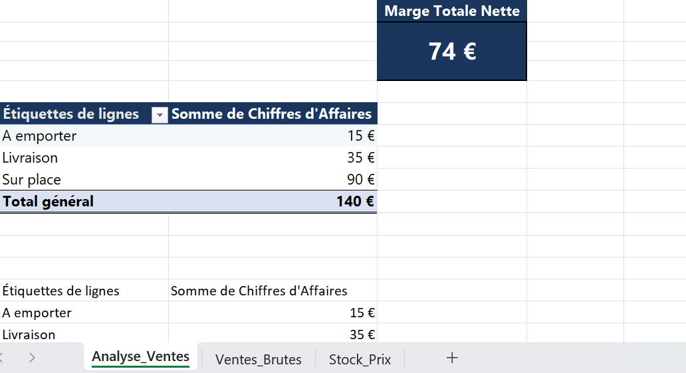

# Dashboard-Analyse-Ventes-Resto
## Description du Projet 
Ce projet consiste en la création d'un outil d'aide à la décision (Bussiness Intelligence ) sur Excel pour structurer des données brutes de ventes, en extraire des indicateurs clés et automatiser le suivi des performances pour un gérant de restaurant 
## Fonctionnalités clés & Compétences techniques
* **KPI Dynamique :** Suivi automatisée de la marge totale net globale (calculée a 74 €).
* **Design Professionnel & Corporate :** Choix d'une charte graphique sobre (Bleu Marine comptable) pour optimiser la lisibilité des rapports financiers .
* **Double Approche de Structuration :**
  1. Utilisation de **Tableaux Croisées dynamique (TCD)** pour une ventilation rapide et instantanée du chiffre d'affaires par canal de vente.
  2. Implémentation de **formules robustes ('SOMME.SI)** garantissant un recalcul automatique et dynamique du tableau de bord en cas d'ajout ou de modification des vents brutes.
     ## Apercu de Dashboard
     Voici une apercu visuel des livrables inclus dans ce depot :
     ### 1. Vision globale du dashboard (KPI,TCD & Graphique)
     
     ### 2. Répartition du chiffre d'affaires par canal (Graphique Circulaire)
     
     ### 3. Analyse par Produit & Formules Robustes
     

     ---
     *Projet réalisé de bout en bout avec une attention particulière portée à la robutesse des donnés et à l'expérience utilisateur (UX).*
     
